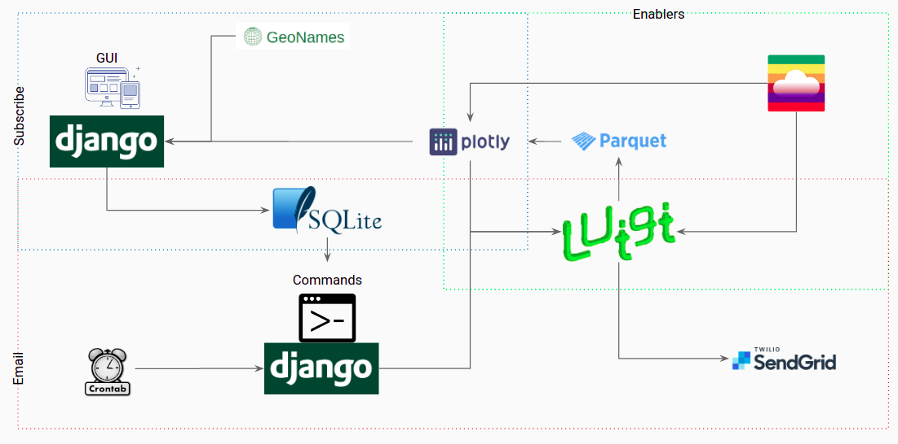
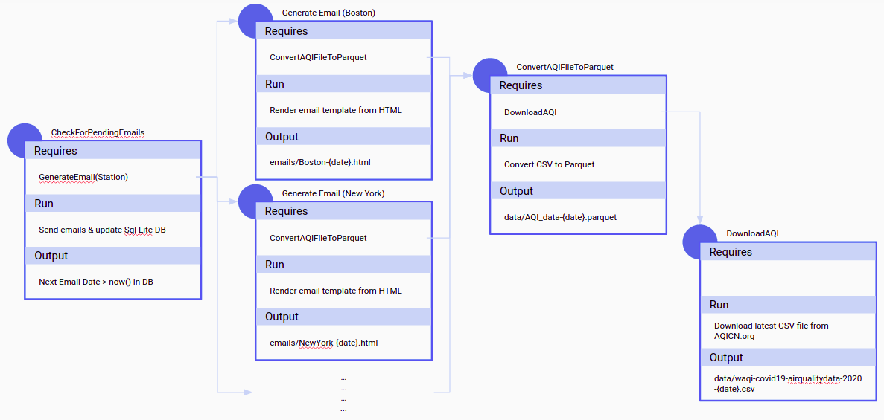

Components & Architecture
=========================

Components
----------

Python is the glue to bring different stacks together! That's the underlying foundation of my choice for this project.

The WarmMail project entailed working with different services, platforms & plugins, and the need was to bring them together and make them work in a harmonized Pythonic way!

There are 3 external services used to make WarmMail happen:

.. image:: warmmail_components_external.png
  :width: 600
  :alt: An image of the report that gets generated

Architecture
------------

After integrating these 3 external components, I had to use a multitude of python frameworks and libraries for this project, namely:

* Django: For exposing the frontend website where a user can come to explore various AQI reports and set up / manage their subscription and also for rendering nice templates for the emails
* Luigi: Orchestrating the complete backend - fetching the updated files from AQICN.org + running the various jobs at regular intervals to send out emails to subscribers
* Plotly: For building visualizations that easily intergate into Django's HTML templates
* Kaleido: To export the various Plotly visualizations to images to be included in emails

The final architecture design:

Backend Orchestration
---------------------

One of the most challenging aspects of this project was the "efficient" use of Luigi. There were 2 main problems to solve in case of the Luigi DAGs to be set up:

1. Luigi only supports file targets and does not support a database row as a target output: This was an extremely interesting problem to sovle. While there is a Luigi target output for SQLAlchemy - that only enables adding (or copying) rows into a database table. There is no way to run a database fitler and process a task based on that filter. To solve this, I had to write my own Target Output class (RowFilterTargetOutput) - I've detailed this in the Python Highlights section.
2. Another problem to solve was triggering multiple requirements based on the outputs above. Also, more on this in the Python Highlights section.

The complete Luigi orchestration and DAGs works as follows:

