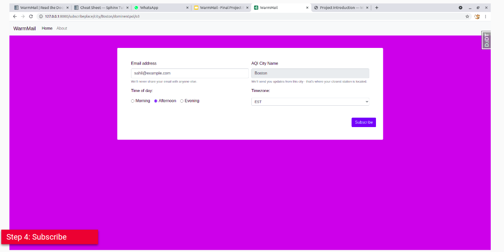

Project Introduction
====================

Warm Mail

Final Project, CSCI E-29 (Spring 2021)

Submitted by: Sahil Sakhuja

.. image:: https://img.shields.io/badge/built%20with-Cookiecutter%20Django-ff69b4.svg?logo=cookiecutter
     :target: https://github.com/pydanny/cookiecutter-django/
     :alt: Built with Cookiecutter Django
.. image:: https://img.shields.io/badge/code%20style-black-000000.svg
     :target: https://github.com/ambv/black
     :alt: Black code style

:License: MIT

Background
----------

With the objective of focusing on the advanced python aspects learnt in the course, I have picked a project which is less heavy on the data science side, but makes greater use of the course concepts themselves.

Idea & Showcase
---------------

The Idea - Warm Mail: AQI updates as an email every day.

Sneak Peek
----------

A small sneak peek into the customer journey:

